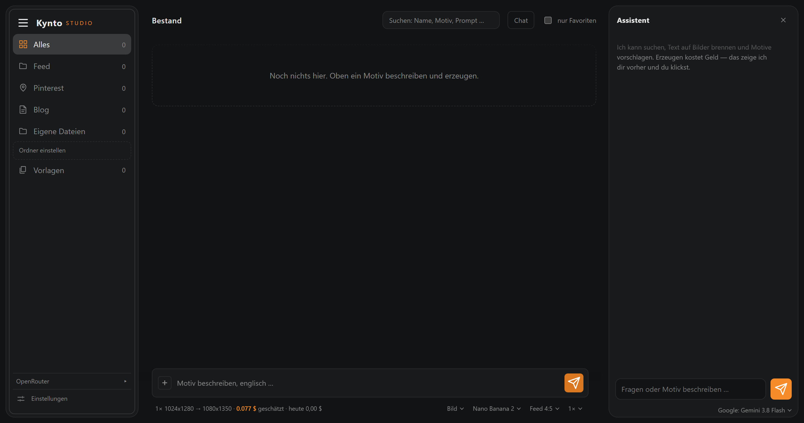
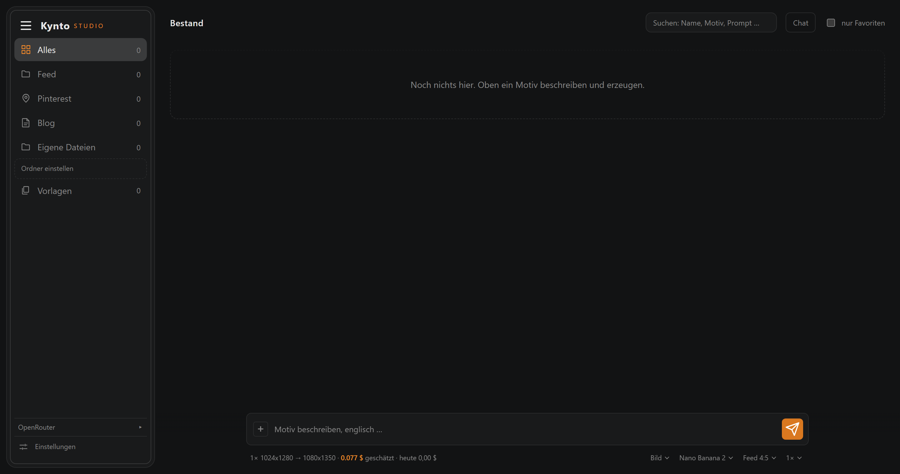
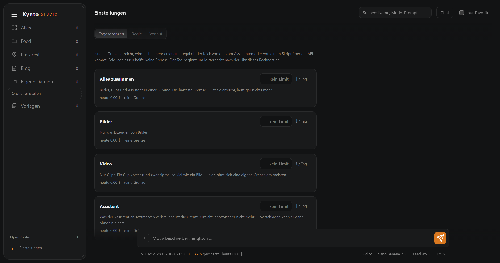
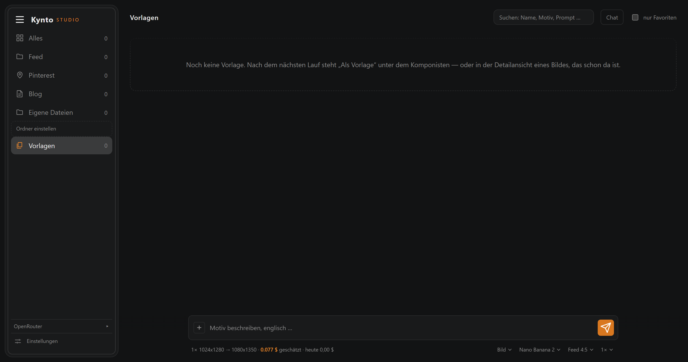

<h1 align="center">Kynto Studio</h1>

<p align="center">
  A local image and video studio for people who want their feed to look like
  <b>one</b> brand.<br>
  Runs on your own machine. Shows the price <b>before</b> you click.
</p>

<p align="center">
  
  
  
  
  
</p>



<sub>A fresh install — empty library, nothing generated yet. The bar at the
bottom always shows what the next click costs.</sub>

> German UI. The code and comments are German too. Contributions welcome
> either way — see [Contributing](#contributing).

---

## Why

Most image tools give you a prompt box and a bill at the end of the month.
This one is built around three things the author kept getting wrong:

- **You see the price before you spend it.** Every model shows its cost.
  Once a model has actually run, the *measured* price from the real invoice
  replaces the estimate.
- **Your style is enforced, not remembered.** A style block is appended to
  every prompt automatically — one for images, one for clips. You cannot
  forget it.
- **The prompt never gets lost.** Every image gets a sidecar JSON next to it.
  Rename or move the file in your file manager — the metadata travels along.

---

## Quick start

```bash
git clone https://github.com/Kynto-intel/kynto-studio.git
cd kynto-studio
copy studio.config.beispiel.json studio.config.json
```

Point `wurzel` in `studio.config.json` at the folder holding your images.
Nothing outside it is ever read or written.

Then give it your [OpenRouter key](https://openrouter.ai/keys) — either copy
`.env.beispiel` to `.env` and put the key in it, or set an environment
variable:

```powershell
[Environment]::SetEnvironmentVariable("OPENROUTER_API_KEY","sk-or-v1-...","User")
```

Start it:

```powershell
.\start.ps1
```

Opens `http://127.0.0.1:4890`, bound to localhost only. There is no
`npm install` — there is nothing to install.

<details>
<summary><b>More on setup</b></summary>

<br>

The gallery folders in the example config are a suggestion — delete what you
do not need. **The app never creates folders on its own.** Start it without a
config and it comes up empty with a note telling you to set your folders up,
which you then do in the app. Nobody gets folders they never asked for
dropped into their filesystem.

If both a `.env` and an environment variable are set, **the environment
variable wins**. The sidebar says which one is in use, so a key that appears
to be ignored is never a mystery.

The key is read on the server and never sent to the browser. There is no
field in the interface to type it into, on purpose.

</details>

---

## Features

- **43 image and 23 video models** through OpenRouter — Nano Banana, GPT
  Image, FLUX.2, Seedream, Veo, Kling, Runway, Sora, Seedance and more. The
  catalog refreshes itself from the live API.
- **Daily spending limits** — four of them: everything together, images,
  video, and the assistant. Once a limit is reached nothing runs — not from
  the button, not from the assistant, not from a script over the API.
- **A built-in assistant** that drives the studio: it searches your library,
  reads your style block, burns text onto images, and **looks at the
  pictures** when the chosen model can see them. When it wants to generate,
  it *proposes* — you click.
- **Templates** — save a run that worked under a name of your own and load it
  back with one click: prompt, model, format, count, switches and reference
  image, with the resulting picture as its thumbnail.
- **Text on images** — 17 curated fonts, colour, outline, shadow, drag to
  position. `*word*` puts a word in the accent colour. Rendered server-side,
  so the preview *is* the result. Costs nothing.
- **Platform formats** — feed, story, square, pin. Generated at the right
  aspect ratio, then scaled to exact platform pixels. No manual cropping.
- **Reference images** — pick any image from your library as a style
  reference. Leave it empty and it runs without. No switch, no second mode.
- **Search** across filename, subject, the full prompt, model and caption. A
  Videos tab appears as soon as the library holds one, and not before.
- **It remembers your setup** — model, format and the switches survive a
  reload. The image count is the deliberate exception: it always starts at 1,
  so a forgotten "6×" never spends six times the money.
- **Plain HTTP API** — the browser interface is just one client.

<details>
<summary><b>The assistant, in detail</b></summary>

<br>

Paid tools have **no execute path on the server at all**, so a chatty model
cannot spend your money — the refusal sits in the code, not only in the
prompt. It never picks a model either: what you set in the app is what
renders.

A **Regie** tab under Settings holds what it knows about the craft — how a
prompt is built, and that a clip tolerates exactly one motion while
everything else must be told to hold still. Plain text; edit it whenever it
stops being true.

It can read your templates, so "make a mockup for this design" reuses the
setup that already worked instead of inventing a new one — and it can write a
rewritten prompt straight into the open template form. That writes nothing to
disk: the text sits in the field until you press save.

It can also read the activity log, so "what did I do yesterday" and "what did
the last clip cost" are answered from what actually happened, not guessed.

Any of OpenRouter's ~360 tool-capable text models can run it — or a local one
through **Ollama**, found automatically, costing nothing and leaving nothing
on the machine. A remote turn costs about a third of a cent.

</details>

<details>
<summary><b>Templates, in detail</b></summary>

<br>

Save from the hint right after a run, or from the detail view of any picture
that is already there — the sidecar knows the same things. One click puts it
all back in the composer and generates **nothing**; you still press the
button.

Name, prompt and reference image can be changed afterwards. Both pictures sit
side by side in the edit view — what goes in and what came out — and a
**generate** button right there runs one image with the current draft
**without saving**, so a template you rely on cannot be ruined by an
experiment.

Below that, every picture the template has produced sits in a grid with its
prompt in plain text; one click puts an old prompt back in the field. The
reference image is copied into the template's own store on save, so tidying up
your gallery never leaves a template blank.

</details>

<details>
<summary><b>What the daily limits honestly cannot do</b></summary>

<br>

The check runs against what has already been billed, so a single run can still
cross the line — a price is only known afterwards, and for video not even
then. It stops the *next* run, not the running one.

</details>

---

## What it looks like

Every shot below is an empty install — nothing generated, nothing configured
beyond the four output folders.

**The library.** Folders on the left with a count each, search on top, the
composer at the bottom. Model, format and count sit next to the price, so the
cost of the next click is never more than one glance away.



**Daily limits.** A ceiling for everything together, and one each for images,
clips and the assistant.



**Templates.** A run you liked, saved under a name, one click back into the
composer.



---

## Requirements

- **Node.js 20 or newer** (uses built-in `fetch` and `FormData`)
- **Windows** — image scaling and text rendering go through PowerShell and
  `System.Drawing`. See [Known limits](#known-limits).
- An **OpenRouter API key** ([openrouter.ai/keys](https://openrouter.ai/keys))

---

## Configuration

`studio.config.json` controls where things live:

| Key | Meaning |
|---|---|
| `wurzel` | root folder. Nothing outside it is ever read or written |
| `port`, `host` | default `4890` on `127.0.0.1` |
| `ordner` | the folders shown in the gallery, relative to `wurzel` |
| `formate` | output formats, target sizes and which folder they land in |

You do not have to edit the file by hand. **Ordner einstellen** in the sidebar
opens a dialog for all of it — rename folders, point them somewhere else, add
or remove them, decide which ones may be written to. Saved without a restart.

Mark a folder `"schreibbar": false` and the app will only display it, never
write into it. Useful for a folder of your own photos.

---

## HTTP API

The server is a plain HTTP API; the browser interface is just one client.
Anything else on your machine can drive it the same way — a script, or your
own agent:

```bash
curl "http://127.0.0.1:4890/api/bestand?suche=raven"
curl -X POST http://127.0.0.1:4890/api/schaetzung -H "content-type: application/json" -d '{"anzahl":3}'
```

Leave out `modell` and `formatId` and the app's own setting applies — the same
rule the assistant follows. Send an `X-Quelle` header to label your calls in
the activity log.

---

## Known limits

**Windows only, for now.** Three files shell out to PowerShell for
`System.Drawing`: `lib/format.mjs`, `lib/text.mjs` and `lib/schriften.mjs`.
Everything else is portable Node. Porting means replacing those three — a
contained job, and probably the single most useful contribution right now.

**Video is beta.** The image path is used daily. The video path (async job,
polling, download) was built and its error paths verified, but it has seen
only a handful of successful runs.

**Duration and resolution come from fixed lists** (3/5/8/10 seconds,
720p/1080p/2K) because OpenRouter does not publish what each model accepts —
no video model names its durations in the model list. If a model rejects a
value, its own message names the ones it takes, and the app remembers that,
so the next click is warned beforehand. There is no automatic correction here
unlike aspect ratio: verifying it would mean rendering clips to find out, and
clips are the expensive part.

**Fonts come from your system.** The app lists what is installed on your
machine; it ships none. A missing font drops out of the menu rather than being
silently substituted.

**No accounts, no multi-user.** A single-person tool that happens to have a
web interface. Do not expose it to a network.

---

## Contributing

Issues and pull requests are welcome. Good first areas:

- **Linux/macOS support** — replace the three PowerShell modules
- **More providers** — the provider modules are small and self-contained, see
  `lib/anbieter-openrouter-bild.mjs` for the shape
- **Video** — more testing, better progress reporting
- **English UI** — currently German; a language file would be the way

The code is deliberately plain: no build step, no framework, no dependencies.
Each module does one thing, `server.mjs` only routes, all logic lives in
`lib/`. Please keep it that way.

Comments explain *why*, not *what* — especially where something works around a
real quirk that cost hours to find. There are a few of those and they are
worth reading before touching the rendering code.

---

## Under the hood

<details>
<summary><b>Folder layout</b></summary>

<br>

```
kynto-studio/
├── server.mjs                 HTTP server, routing only
├── start.ps1                  starts the server
├── studio.config.json         your paths (git-ignored)
├── .env                       your API key (git-ignored)
├── lib/                       one module per job
│   ├── konfig.mjs             paths, port, keys
│   ├── anbieter-*.mjs         providers (image, video)
│   ├── modelle-*.mjs          model catalogs, self-refreshing
│   └── ...
├── skripte/                   PowerShell helpers
│   ├── resize.ps1             crop and scale
│   └── text.ps1               render text onto an image
├── web/                       the interface, no build step
├── bilder/                    screenshots for this README
└── daten/                     runtime data, git-ignored
    ├── verlauf.json           activity log with full prompts
    ├── verbrauch.json         spending and measured model prices
    ├── vorlagen.json          your saved runs
    ├── gelernt.json           limits learned from provider rejections
    ├── stil-block.txt         your style block for images, plain text
    ├── stil-block-video.txt   the same for clips
    ├── regie.txt              what the assistant knows about the craft
    └── text-verlauf/          every earlier version of those three files
```

`daten/` is created on first start. Delete it and the app starts fresh — your
images are never touched, they live under `wurzel`.

</details>

<details>
<summary><b>The style block</b></summary>

<br>

Two plain text files: `daten/stil-block.txt` goes onto every image prompt,
`daten/stil-block-video.txt` onto every clip. They are separate because a
video model needs different words — grain and camera character matter, "no
distorted hands" does not, and a clip additionally has to be told not to cut.
Neither one describes motion; that belongs in the prompt.

The composer shows whichever block matches the mode you are in — switch
between Bild and Video and the field follows. Edit them in the app or in any
text editor; both are re-read on **every** prompt, so changes take effect
immediately without restarting anything. Emptying one in the app restores its
default rather than deleting the file.

Every earlier version is kept in `daten/text-verlauf/`: the old state is
archived before it is overwritten, so a style block you later talked yourself
out of is never gone.

</details>

<details>
<summary><b>Activity log</b></summary>

<br>

Everything the app does is recorded: what was generated, with which prompt and
model, what it cost. It sits under **Einstellungen** as the third tab, in four
areas — images with their prompts and thumbnails, videos, the assistant
conversation, and settings changes.

The log lives in `daten/verlauf.json` and never leaves your machine.

</details>

---

## License

MIT — see [LICENSE](LICENSE).
